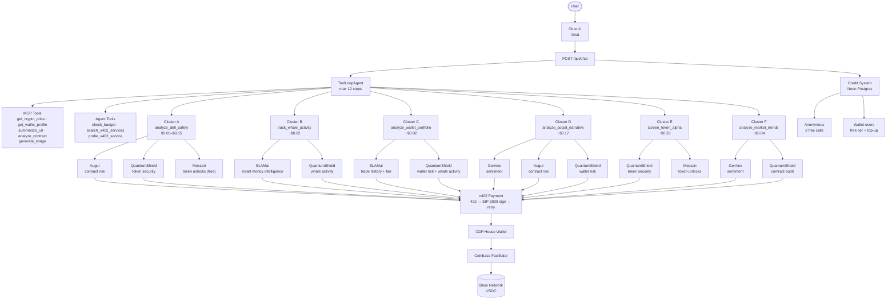

# x402 AI Agent

An AI agent that pays for intelligence using USDC on Base via the [x402](https://x402.org) protocol — autonomous micropayments for every tool call.

Built with Next.js, AI SDK v6, and Coinbase CDP wallets.

## What it does

Ask anything crypto-related and the agent autonomously calls the right combination of paid x402 services, pays for them with USDC, and synthesizes a cross-referenced answer:

- **DeFi safety analysis** — rug pull detection, honeypot checks, smart contract audits, token unlock schedules
- **Whale tracking** — smart money intelligence, top holder profiles, accumulation patterns
- **Social narrative** — sentiment analysis, on-chain reputation, contract risk scoring
- **Market trends** — liquidity analysis, sentiment signals, contract auditing
- **Live crypto prices** — real-time price feeds
- **Wallet profiling** — on-chain balances and activity
- **Webpage summaries** — fetch and summarize any URL
- **Smart contract analysis** — analyze verified contracts
- **Image generation** — AI-generated images

## Credit model

| Tier | Access |
|------|--------|
| Anonymous | 2 free tool calls (session cookie) |
| Wallet connected, < 7 days old | $0.10 free credits |
| Wallet connected, 7–30 days old | $0.25 free credits |
| Wallet connected, > 30 days old | $0.50 free credits |
| Depleted | Top up with USDC |

Free credits are claimed once on wallet connect. Wallet age is verified via Basescan as a Sybil guard.

## Supported Deposit Chains

Users can deposit USDC from any of these chains. All deposits are credited instantly to the user's balance.

| Chain    | Chain ID | USDC Contract                                |
|----------|----------|----------------------------------------------|
| Base     | 8453     | `0x833589fCD6eDb6E08f4c7C32D4f71b54bdA02913` |
| Ethereum | 1        | `0xA0b86991c6218b36c1d19D4a2e9Eb0cE3606eB48` |
| Arbitrum | 42161    | `0xaf88d065e77c8cC2239327C5EDb3A432268e5831` |
| Optimism | 10       | `0x0b2C639c533813f4Aa9D7837CAf62653d097Ff85` |

All chains share the same deposit address — your CDP-managed Purchaser wallet (`DEPOSIT_ADDRESS` env var).
See `docs/ops/multi-chain.md` for full configuration details.

## x402 Services

The agent orchestrates independent x402 services grouped into research clusters:

| Service | Provider | Cost | Used for |
|---------|----------|------|---------|
| Augur | augurrisk.com | $0.10 | Contract risk scoring |
| SLAMai | api.slamai.dev | $0.001 | Smart money intelligence, whale profiling |
| GenVox | api.genvox.io | $0.03 | Sentiment analysis |
| QuantumShield | quantumshield-api.vercel.app | $0.001–$0.003 | Token security, wallet risk, whale activity |
| Messari | api.messari.io | free / $0.25 | Token unlock schedules, allocation data |

### Research Clusters

| Cluster | Tool | Services | Cost |
|---------|------|----------|------|
| A — DeFi Safety | `analyze_defi_safety` | Augur + QuantumShield + Messari | $0.05–$0.15 |
| B — Whale Tracker | `track_whale_activity` | SLAMai + QuantumShield | ~$0.02 |
| C — Wallet Portfolio | `analyze_wallet_portfolio` | SLAMai + QuantumShield | ~$0.02 |
| D — Social Narrative | `analyze_social_narrative` | GenVox + Augur + QuantumShield | ~$0.17 |
| E — Token Alpha | `screen_token_alpha` | QuantumShield + Messari | ~$0.33 |
| F — Market Trends | `analyze_market_trends` | GenVox + QuantumShield | ~$0.04 |

Each cluster calls its services in parallel, gracefully handles unavailable ones, and returns cross-referenced results.

## Architecture



### Pages

| Route | Purpose |
|-------|---------|
| `/` | Landing page — hero, research clusters, MCP tools, pricing |
| `/chat` | AI chat interface with suggestion categories |

### API Routes

| Route | Purpose |
|-------|---------|
| `POST /api/chat` | Chat endpoint — ToolLoopAgent with streaming and payment tracking |
| `GET/POST /mcp` | MCP server — paid tools |
| `GET /api/credits/balance` | Get wallet credit balance |
| `POST /api/credits/topup` | Initiate USDC deposit |
| `POST /api/credits/topup/confirm` | Confirm deposit transaction |
| `POST /api/credits/claim` | Claim free credits on wallet connect |
| `GET /api/credits/check-topups` | Cron — check pending top-ups (daily) |
| `POST /api/credits/webhook` | Alchemy webhook for deposit confirmation |
| `GET/POST /api/registry` | x402 service registry |
| `POST /api/v1/research/*` | Public x402-gated research API |

### Key Modules

| Module | Location | Purpose |
|--------|----------|---------|
| Chat API | `src/app/api/chat/route.ts` | Request handler, agent setup, credit deduction |
| Orchestrator | `src/lib/agents/orchestrator.ts` | ToolLoopAgent with system prompt and tools |
| AI Provider | `src/lib/ai-provider.ts` | Probe-based model fallback chain (5-min TTL) |
| Credit Store | `src/lib/credits/credit-store.ts` | USDC credit balances in Neon Postgres |
| Session Store | `src/lib/credits/session-store.ts` | Anonymous free-call tracking |
| Wallet Age | `src/lib/credits/wallet-age.ts` | Basescan Sybil guard for free credit tiers |
| Service Registry | `src/lib/services/registry.ts` | Real/stub adapter resolution by network |
| Research Clusters | `src/lib/clusters/` | Multi-service orchestration |
| x402 Client | `src/lib/x402-client.ts` | v1/v2 compatible payment header creation |
| MCP Server | `src/app/mcp/route.ts` | Paid MCP tools |

## Payment Flow

1. Agent calls a cluster tool (e.g. `analyze_defi_safety`)
2. Cluster calls each x402 service in sequence
3. Service returns **402 Payment Required** with payment requirements
4. `callWithPayment()` reads the 402 body, normalizes v1/v2 schema
5. House wallet signs an **EIP-3009 authorization** (gasless, off-chain)
6. Request retries with `X-Payment` header
7. Coinbase facilitator verifies and settles USDC on Base
8. Tool returns result + cost
9. Credit system deducts cost (+ 30% markup) from user's balance

## Quick Start

### Prerequisites

- **Node.js 18+** and **pnpm** (`corepack enable`)
- **Coinbase CDP credentials** — [portal.cdp.coinbase.com](https://portal.cdp.coinbase.com/)
- **DeepSeek API key** — [platform.deepseek.com](https://platform.deepseek.com/) (local dev)
- **Neon Postgres** — for the credit system
- **Google Gemini API key** — fallback model

### 1. Clone and install

```bash
git clone https://github.com/aijayz/x402-ai-agent
cd x402-ai-agent
pnpm install
```

### 2. Configure environment

```bash
cp .env.example .env.local
```

Key variables:

```bash
# CDP Credentials (required -- wallets won't work without these)
CDP_API_KEY_ID=your_key_id
CDP_API_KEY_SECRET=your_secret
CDP_WALLET_SECRET=your_wallet_secret

# Your CDP purchaser wallet address (set after first run)
DEPOSIT_ADDRESS=0x...

# AI models
DEEPSEEK_API_KEY=your_deepseek_key
GOOGLE_GENERATIVE_AI_API_KEY=your_google_key

# Database (Neon Postgres)
DATABASE_URL=postgresql://...

# Network (base-sepolia for testnet, base for mainnet)
NETWORK=base-sepolia
NEXT_PUBLIC_NETWORK=base-sepolia
URL=http://localhost:3000
```

See `.env.example` for the full list including x402 service URLs, rate limiting, and Alchemy webhook config.

### 3. Run

```bash
pnpm dev
```

Open [http://localhost:3000](http://localhost:3000).

On `base-sepolia`, all x402 service calls use stub adapters with deterministic mock data — no real payments or external API calls.

### 4. Switch to mainnet

Set `NETWORK=base` and `NEXT_PUBLIC_NETWORK=base` (requires a redeploy on Vercel due to build-time env inlining), and configure the x402 service URLs:

```bash
AUGUR_URL=https://augurrisk.com
GENVOX_URL=https://api.genvox.io
SLAMAI_URL=https://api.slamai.dev
QUANTUM_SHIELD_URL=https://quantumshield-api.vercel.app
```

## Development

```bash
pnpm dev          # Start dev server (Turbopack)
pnpm build        # Production build
pnpm typecheck    # TypeScript check
pnpm test         # Run test suite (Vitest)
```

### Testnet faucets

- **USDC**: [faucet.circle.com](https://faucet.circle.com/)
- **ETH** (gas): [alchemy.com/faucets/base-sepolia](https://www.alchemy.com/faucets/base-sepolia)

### Wallet sweep script

```bash
# Preview balances
npx tsx scripts/sweep.ts --to 0xYourColdWallet --dry-run

# Sweep both wallets
npx tsx scripts/sweep.ts --to 0xYourColdWallet
```

## Deploying to Vercel

```bash
# 1. Link project
vercel link

# 2. Set environment variables in Vercel Dashboard
#    (or via: vercel env add)

# 3. Deploy
vercel --prod
```

> **Note:** `@t3-oss/env-nextjs` inlines environment variables at build time. Changing env vars on Vercel requires a redeploy.

## Configuration Reference

### Environment Variables

| Variable | Required | Description |
|----------|----------|-------------|
| `CDP_API_KEY_ID` | Yes | Coinbase CDP API key ID |
| `CDP_API_KEY_SECRET` | Yes | Coinbase CDP API secret |
| `CDP_WALLET_SECRET` | Yes | Wallet encryption key |
| `DEPOSIT_ADDRESS` | Yes | CDP purchaser wallet address (set after first `pnpm dev`) |
| `DATABASE_URL` | Yes | Neon Postgres connection string |
| `DEEPSEEK_API_KEY` | Local dev | Direct DeepSeek API key |
| `GOOGLE_GENERATIVE_AI_API_KEY` | Yes | Gemini fallback model |
| `AI_MODEL` | No | Primary model (default: `deepseek/deepseek-chat`) |
| `NETWORK` | No | `base-sepolia` or `base` (default: `base-sepolia`) |
| `NEXT_PUBLIC_NETWORK` | No | Same as `NETWORK`, exposed to client |
| `URL` | No | App URL (auto-derived on Vercel) |
| `UPSTASH_REDIS_REST_URL` | No | Rate limiting (graceful degradation without) |
| `UPSTASH_REDIS_REST_TOKEN` | No | Rate limiting |
| `ALCHEMY_WEBHOOK_SECRET` | No | Webhook signature verification |

### Networks

| Network | `NETWORK` value | Chain ID | Use case |
|---------|----------------|----------|----------|
| Base Sepolia | `base-sepolia` | 84532 | Development (stub services, no real payments) |
| Base Mainnet | `base` | 8453 | Production (real x402 services, real USDC) |

## Known Limitations

- **Build-time env**: `@t3-oss/env-nextjs` inlines env vars at build time — env changes on Vercel require a redeploy
- **Mid-stream model failure**: If a model dies during streaming, the current request fails; the next request auto-recovers via probe cache invalidation
- **Google Gemini free tier**: Limited to ~20 req/day — not suitable as primary model for production traffic
- **x402 v1/v2**: Our client normalizes both schemas, but assumes Base network (eip155:8453 / eip155:84532)

## References

- [x402 Protocol](https://x402.org)
- [AI SDK v6](https://sdk.vercel.ai/docs)
- [Coinbase CDP](https://docs.cdp.coinbase.com/)
- [MCP Specification](https://modelcontextprotocol.io)

## License

MIT
