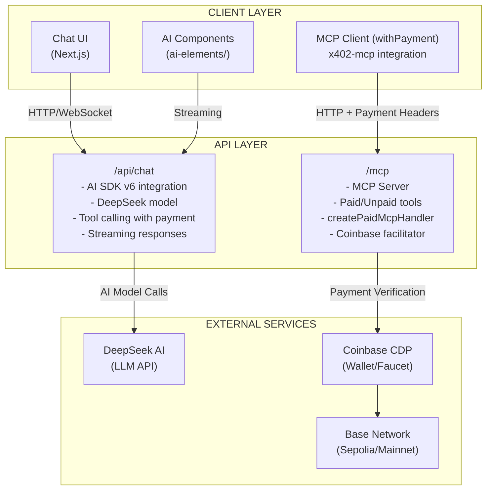
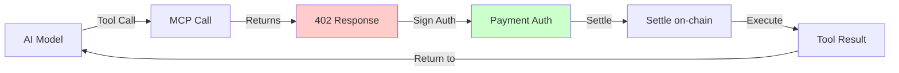
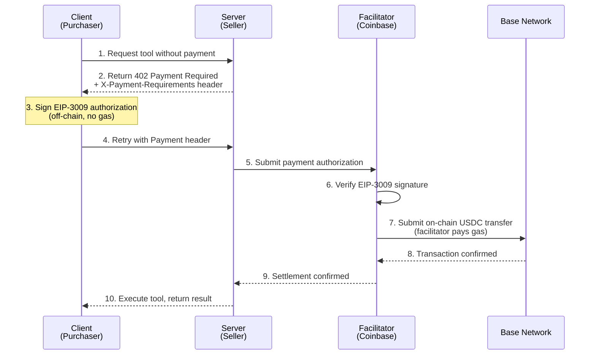
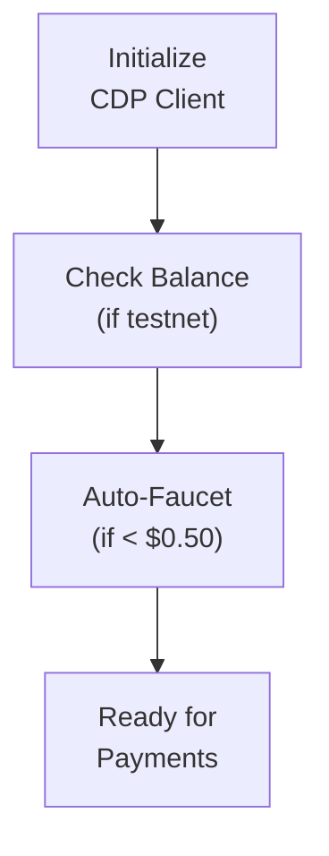
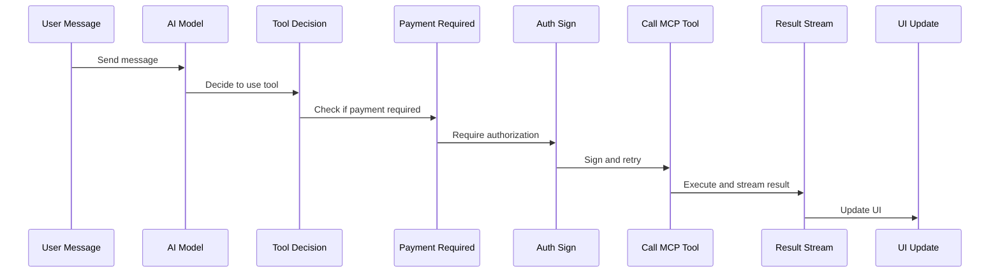
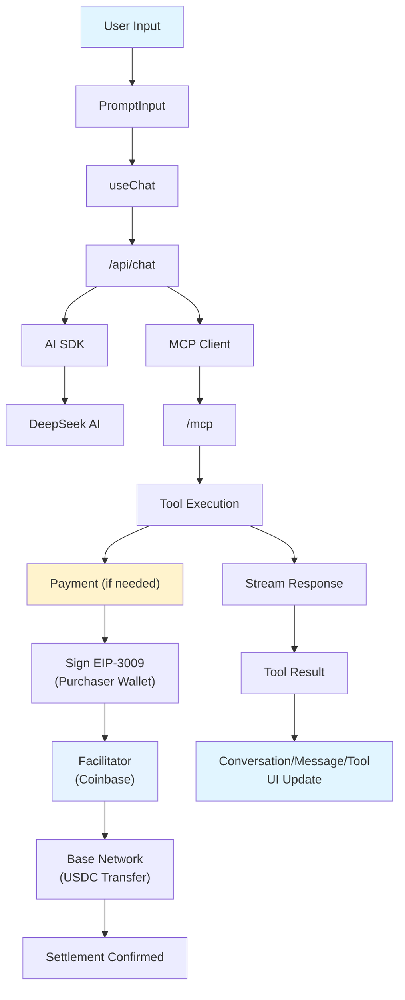

# x402 AI Agent - Architecture Design Document

## 1. System Architecture Overview

### 1.1 High-Level Architecture



### 1.2 Core Components

| Component | Technology | Purpose |
|-----------|------------|---------|
| Frontend | Next.js 15 + React 19 | Chat interface and UI components |
| AI SDK | ai@^6.0.0 | Streaming chat, tool calling |
| MCP Server | x402-mcp | Paid tool server implementation |
| MCP Client | x402-mcp | Payment-enabled client wrapper |
| Wallets | CDP SDK | Managed wallets for payments |
| Blockchain | Base (Sepolia/Mainnet) | USDC payment settlement |

---

## 2. MCP Integration Patterns

### 2.1 Server-Side MCP (Route Handler)

**Location**: `src/app/mcp/route.ts`

```typescript
// Pattern: Remote MCP Server with Payment Support
import { createPaidMcpHandler, PaymentMcpServer } from "x402-mcp/server";
import z from "zod";

export async function POST(request: Request) {
  const handler = createPaidMcpHandler(
    (server: PaymentMcpServer) => {
      // Free tools - 4 parameters: (name, description, schema, handler)
      server.tool(
        "get_random_number",
        "Get a random number between two numbers",
        { min: z.number().int(), max: z.number().int() },
        async (args) => ({
          content: [{ type: "text", text: String(Math.random()) }],
        })
      );

      server.tool(
        "add",
        "Add two numbers",
        { a: z.number().int(), b: z.number().int() },
        async (args) => ({
          content: [{ type: "text", text: String(args.a + args.b) }],
        })
      );

      server.tool(
        "hello-remote",
        "Receive a greeting",
        { name: z.string() },
        async (args) => ({
          content: [{ type: "text", text: `Hello ${args.name}` }],
        })
      );

      // Paid tools - 6 parameters: (name, description, { price }, schema, {}, handler)
      server.paidTool(
        "premium_random",
        "Get a premium random number with special formatting",
        { price: 0.01 }, // $0.01 USDC
        { min: z.number().int(), max: z.number().int() },
        {},
        async (args) => ({
          content: [{ type: "text", text: `Premium: ${Math.random()}` }],
        })
      );

      server.paidTool(
        "premium_analysis",
        "AI-powered analysis of a number",
        { price: 0.02 }, // $0.02 USDC
        { number: z.number() },
        {},
        async (args) => ({
          content: [{ type: "text", text: `Analysis of: ${args.number}` }],
        })
      );
    },
    {
      serverInfo: { name: "x402-ai-agent", version: "0.1.0" },
    },
    {
      recipient: sellerAccount.address,
      network: env.NETWORK,
      facilitator: { url: "https://x402.org/facilitator" },
    }
  );

  return handler(request);
}
```

### 2.2 Tool Types

| Type | Function | Parameters | Payment | Example Tools |
|------|----------|------------|---------|---------------|
| Free | `server.tool()` | 4: `(name, description, schema, handler)` | Not required | `add`, `get_random_number`, `hello-remote` |
| Paid | `server.paidTool()` | 6: `(name, description, {price}, schema, {}, handler)` | Required via x402 | `premium_random` ($0.01), `premium_analysis` ($0.02) |
| Local | `tool()` from `ai` pkg | 3: `({description, inputSchema, execute})` | Not required | `hello-local` (client-side only) |

### 2.3 Client-Side MCP (Chat API)

**Location**: `src/app/api/chat/route.ts`

```typescript
// Pattern: MCP Client with Automatic Payment
import { StreamableHTTPClientTransport } from "@modelcontextprotocol/sdk/client/streamableHttp.js";

// Wrap fetch with payment handler
const fetchWithPayment = wrapFetchWithPayment(fetch, walletClient);

// Create MCP client with StreamableHTTP transport
const mcpClient = await createMCPClient({
  transport: new StreamableHTTPClientTransport(
    new URL("/mcp", requestUrl),
  ),
});

// Local tool defined directly in chat route (not from MCP server)
const localTools = {
  "hello-local": {
    description: "Say hello from local tool",
    parameters: z.object({}),
    execute: async () => "Hello from local tool!",
  },
};

// Tools automatically become available to AI
const tools = await mcpClient.tools();
```

### 2.4 Payment Flow Integration



---

## 3. Payment Flow Architecture

### 3.1 x402 Protocol Flow



### 3.2 Payment Components

| Component | Role | Implementation |
|-----------|------|----------------|
| Purchaser Wallet | Pays for tools | CDP-managed, auto-faucet |
| Seller Wallet | Receives payments | CDP-managed |
| Facilitator | Settles payments | Coinbase x402 facilitator |
| Network | Settlement layer | Base Sepolia (test) / Base (prod) |

### 3.3 Facilitator Role in x402

The facilitator is a trusted third-party service that enables **gasless payments** in the x402 protocol.

#### Responsibilities

| Function | Description |
|----------|-------------|
| Signature Verification | Validates EIP-3009 authorization off-chain |
| Gas Payment | Pays transaction gas fees on behalf of purchasers |
| On-chain Settlement | Submits USDC transfer to the blockchain |
| Trust Anchor | Both client and server trust the facilitator to act honestly |

#### Why a Facilitator?

Traditional on-chain payments require users to hold ETH for gas. The facilitator solves this:

- **Gasless UX**: Users only need USDC, no ETH required
- **Off-chain Verification**: Signature checked before expensive on-chain operation
- **Batching Potential**: Facilitator can batch multiple payments for efficiency

#### Trust Model

All parties trust the Coinbase facilitator to:
1. Correctly verify EIP-3009 signatures
2. Submit valid on-chain transactions
3. Not censor or delay payments maliciously

#### Default Configuration

```typescript
facilitator: {
  url: "https://x402.org/facilitator",  // Default Coinbase facilitator
}
```

### 3.4 Pricing Configuration

```typescript
// Fixed pricing per tool
const TOOL_PRICING = {
  premium_random: "$0.01",      // $0.01 USDC
  premium_analysis: "$0.02",    // $0.02 USDC
};

// Maximum per-call limit
const MAX_PAYMENT_PER_CALL = "$0.10";
```

---

## 4. Wallet Management (CDP)

### 4.1 Wallet Architecture

**Location**: `src/lib/accounts.ts`

Wallets are **dynamically generated** by CDP on first use, not hardcoded. The addresses below are examples from a specific deployment:

```typescript
// Wallet creation pattern (addresses are dynamic)
const purchaserWallet = await getOrCreatePurchaserAccount();
const sellerWallet = await getOrCreateSellerAccount();

// Example addresses (will differ per deployment):
// purchaserWallet.address: "0x58F34156c7fA8a37f877e0CfE0A3A2234e97751e"
// sellerWallet.address:    "0x545442553E692D0900005d7e48885684Daa0C4f0"

// Wallet purposes:
// - Purchaser: Pays for AI tool calls (max $0.10 per call)
// - Seller: Receives tool payments
```

### 4.2 Wallet Lifecycle



### 4.3 CDP Integration

```typescript
// CDP Configuration
const cdpClient = new CdpClient({
  apiKeyId: env.CDP_API_KEY_ID,
  apiKeySecret: env.CDP_API_KEY_SECRET,
  walletSecret: env.CDP_WALLET_SECRET,
});

// Wallet retrieval (existing) or creation (new)
const wallet = await cdpClient.getOrCreateWallet(walletId);
```

### 4.4 Security Considerations

- **API Keys**: Stored in environment variables only
- **Wallet Secret**: Separate from API keys, protects wallet data
- **Address Exposure**: Public addresses are safe to expose
- **Private Keys**: Never exposed, managed by CDP

---

## 5. Chat API Design

### 5.1 API Specification

**Endpoint**: `POST /api/chat`

**Request**:
```json
{
  "messages": [
    { "role": "user", "content": "Get me a premium random number" }
  ],
  "model": "deepseek-chat"
}
```

**Response**: SSE Stream (text/event-stream)
```
event: text
data: {"content": "I'll get you a premium random number."}

event: tool-call
data: {"tool": "premium_random", "status": "pending_payment"}

event: tool-result
data: {"tool": "premium_random", "result": 42}

event: text
data: {"content": "Your premium number is 42!"}
```

### 5.2 Streaming Architecture

```typescript
// AI SDK v6 streaming pattern
const result = streamText({
  model: deepseek("deepseek-chat"),
  messages,
  tools: mcpTools,  // From MCP client
  experimental_activeTools: [...],
});

// Return streaming response
return result.toDataStreamResponse({
  sendReasoning: true,  // DeepSeek reasoner support
});
```

### 5.3 Tool Execution Flow



---

## 6. AI SDK Integration

### 6.1 AI SDK v6 Configuration

**Provider**: DeepSeek
**Models**: 
- `deepseek-chat` - General conversation
- `deepseek-reasoner` - Chain-of-thought reasoning

### 6.2 Provider Setup

```typescript
// DeepSeek provider is created directly in the chat route
// No separate file needed - imported inline in src/app/api/chat/route.ts
import { createDeepSeek } from "@ai-sdk/deepseek";

const deepseek = createDeepSeek({
  apiKey: env.DEEPSEEK_API_KEY,
});

// Usage in streamText()
const result = streamText({
  model: deepseek("deepseek-chat"),
  messages,
  tools,
});
```

### 6.3 Model Capabilities

| Model | Streaming | Tools | Reasoning |
|-------|-----------|-------|-----------|
| deepseek-chat | Yes | Yes | No |
| deepseek-reasoner | Yes | Limited | Yes (visible) |

### 6.4 Tool Schema Definition

```typescript
// Tools are dynamically loaded from MCP
const tools = await mcpClient.tools();

// Each tool has:
// - name: string
// - description: string  
// - parameters: Zod schema
// - execute: async function
```

---

## 7. Component Architecture

### 7.1 Component Hierarchy

```
src/components/
├── ai-elements/           # AI SDK v6 streaming components
│   ├── conversation.tsx   # Scrollable message container
│   ├── message.tsx        # Message display (user/assistant)
│   ├── tool.tsx           # Tool call visualization
│   ├── prompt-input.tsx   # Chat input + model selector
│   ├── response.tsx       # AI response streaming
│   ├── reasoning.tsx      # DeepSeek reasoner thoughts
│   ├── loader.tsx         # Loading states
│   ├── suggestion.tsx     # Quick suggestion buttons
│   └── code-block.tsx     # Syntax highlighted code
```

### 7.2 Component Responsibilities

| Component | Responsibility | Key Props |
|-----------|---------------|-----------|
| `Conversation` | Scroll management, message list | messages, isLoading |
| `Message` | Render user/assistant messages | role, content, toolInvocations |
| `Tool` | Show tool execution status | toolName, status, result, paymentStatus |
| `PromptInput` | User input, model selection | onSubmit, models, disabled |
| `Response` | Stream AI responses | content, isStreaming |
| `Reasoning` | Display reasoning steps | reasoningText |

### 7.3 Streaming State Management

```typescript
// AI SDK useChat hook manages state
const {
  messages,        // Current conversation
  input,           // Input field value
  handleSubmit,    // Form submission
  status,          // 'streaming' | 'ready' | 'error'
} = useChat({
  api: "/api/chat",
  onError: handleError,
});
```

---

## 8. Security Considerations

### 8.1 Threat Model

| Threat | Mitigation |
|--------|------------|
| API Key Exposure | Environment variables only, never in client |
| Wallet Theft | CDP-managed, private keys never exposed |
| Replay Attacks | EIP-3009 nonces, unique per authorization |
| Man-in-Middle | HTTPS only, signature verification |
| Price Manipulation | Fixed server-side pricing, client can't modify |
| Unauthorized Tools | Server validates all tool calls |

### 8.2 Secrets Management

```
Environment Variables (Server Only):
├── CDP_API_KEY_ID         # CDP API authentication
├── CDP_API_KEY_SECRET     # CDP API secret
├── CDP_WALLET_SECRET      # Wallet encryption key (CDP-managed wallets)
├── EVM_PRIVATE_KEY        # Self-managed EVM wallet (optional)
├── SVM_PRIVATE_KEY        # Self-managed Solana wallet (optional)
├── DEEPSEEK_API_KEY       # AI model access
├── NETWORK                # base-sepolia | base
└── URL                    # App URL for MCP client
```

### 8.3 Payment Security

- **Authorization**: EIP-3009 standard for USDC transfers
- **Settlement**: Coinbase facilitator handles on-chain verification
- **Limits**: Maximum $0.10 per transaction
- **Network**: Testnet for development, mainnet for production

---

## 9. Deployment Architecture

### 9.1 Development Environment

```
Local Development:
├── Next.js Dev Server (Turbopack)
├── Base Sepolia Testnet
├── CDP Sandbox
└── Hot reload for AI/frontend changes
```

**Commands**:
```bash
pnpm dev      # Start dev server with Turbopack
pnpm typecheck # TypeScript validation
pnpm build    # Production build
```

### 9.2 Production Environment

```
Vercel Deployment:
├── Edge Runtime (API routes)
├── Base Mainnet
├── CDP Production
└── Environment-based config
```

### 9.3 Environment Configuration

| Variable | Development | Production |
|----------|-------------|------------|
| `NETWORK` | base-sepolia | base |
| `URL` | http://localhost:3000 | https://your-domain.com |
| CDP Keys | Sandbox | Production |
| DeepSeek | API Key | API Key |

### 9.4 Monitoring & Observability

- **Logs**: Vercel function logs
- **Errors**: Sentry integration recommended
- **Payments**: CDP dashboard for wallet activity
- **AI**: DeepSeek API usage tracking

---

## 10. Data Flow Summary



---

## 11. Key Design Decisions

| Decision | Rationale |
|----------|-----------|
| CDP-Managed Wallets | No private key exposure, built-in faucet |
| x402 Protocol | HTTP-native, no smart contract deployment |
| MCP Standard | Interoperable AI tool protocol |
| AI SDK v6 | Streaming, tool calling, React integration |
| DeepSeek | Cost-effective, reasoning capabilities |
| Next.js 15 | API routes + frontend in one deployment |
| Turbopack | Fast HMR for development |

---

*Document generated for x402 AI Agent codebase*
