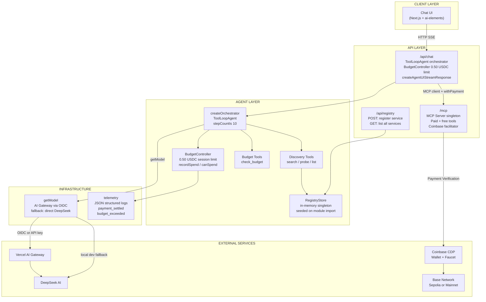
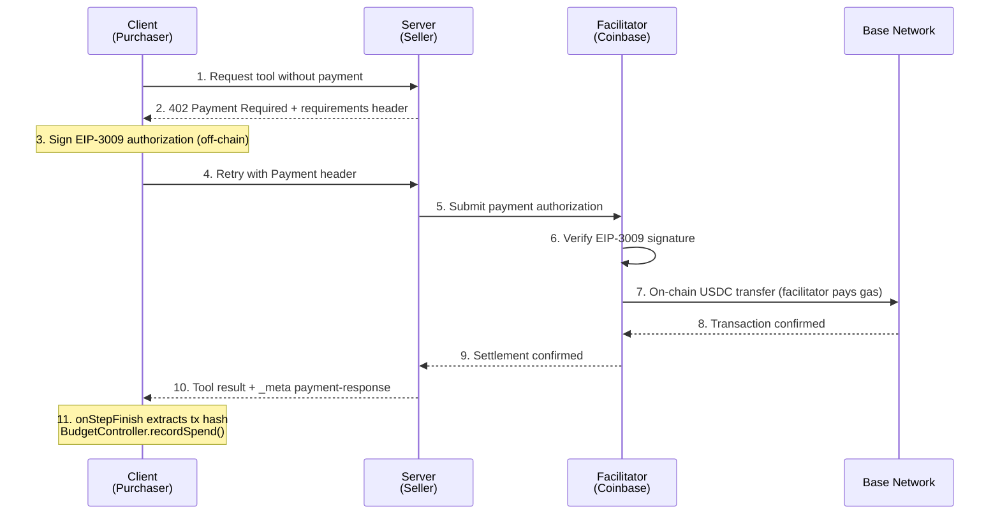
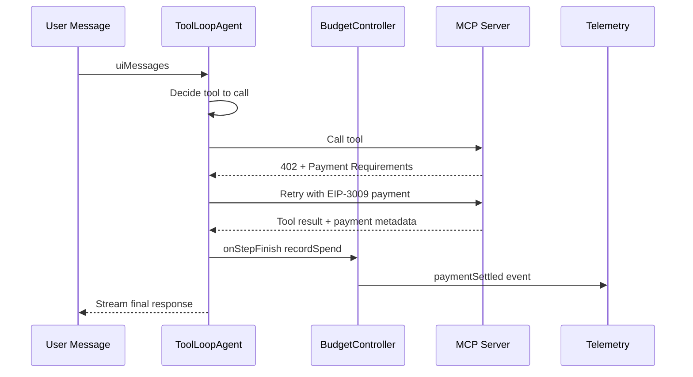
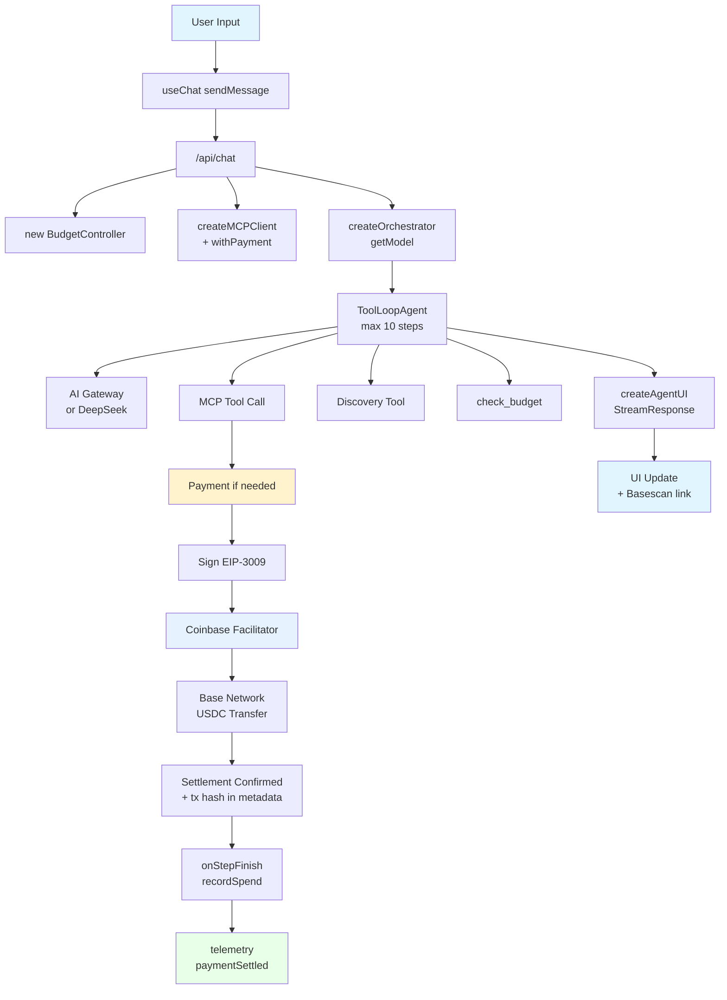

# x402 AI Agent - Architecture Design Document

## 1. System Architecture Overview

### 1.1 High-Level Architecture



### 1.2 Core Components

| Component | Technology | Purpose |
|-----------|------------|---------|
| Frontend | Next.js 15 + React 19 | Chat interface and UI components |
| AI SDK | ai@^6 | ToolLoopAgent, createAgentUIStreamResponse, streaming |
| Agent Orchestrator | `ToolLoopAgent` (AI SDK v6) | Multi-step tool calling with budget awareness |
| BudgetController | Custom class | Per-session $0.50 USDC spend limit + audit trail |
| RegistryStore | In-memory singleton | x402 service discovery registry |
| Discovery Tools | AI SDK `tool()` | Agent can search/probe registered x402 services |
| AI Provider | `getModel()` + AI Gateway | Multi-provider model routing with local fallback |
| Telemetry | JSON console logger | Structured payment and budget events |
| MCP Server | x402-mcp | Paid tool server (cached singleton via `getHandler()`) |
| MCP Client | x402-mcp `withPayment()` | Payment-enabled MCP client wrapper |
| Wallets | CDP SDK | Managed wallets for payments |
| Blockchain | Base (Sepolia/Mainnet) | USDC payment settlement |

---

## 2. MCP Integration Patterns

### 2.1 Server-Side MCP (Route Handler)

**Location**: `src/app/mcp/route.ts`

The MCP handler is a **module-level singleton** created lazily on the first request. Both `GET` and `POST` share the same handler instance.

```typescript
import { createPaidMcpHandler, PaymentMcpServer } from "x402-mcp/server";
import { getOrCreateSellerAccount } from "@/lib/accounts";

let handler: ReturnType<typeof createPaidMcpHandler> | null = null;

async function getHandler() {
  if (!handler) {
    const sellerAccount = await getOrCreateSellerAccount();
    handler = createPaidMcpHandler(
      (server: PaymentMcpServer) => {
        // Free tools - 4 params: (name, description, schema, handler)
        server.tool("add", "Add two numbers",
          { a: z.number().int(), b: z.number().int() },
          async (args) => ({ content: [{ type: "text", text: String(args.a + args.b) }] })
        );

        // Paid tools - 6 params: (name, description, {price}, schema, {}, handler)
        server.paidTool("premium_random", "Premium random number",
          { price: 0.01 }, // $0.01 USDC
          { min: z.number().int(), max: z.number().int() }, {},
          async (args) => ({ content: [{ type: "text", text: `Premium: ${randomNumber}` }] })
        );
      },
      { serverInfo: { name: "x402-ai-agent", version: "0.1.0" } },
      {
        recipient: sellerAccount.address,
        network: env.NETWORK,
        facilitator: { url: "https://x402.org/facilitator" },
      }
    );
  }
  return handler;
}

// Both GET and POST share the same cached handler
export async function GET(req: Request) { return (await getHandler())(req); }
export async function POST(req: Request) { return (await getHandler())(req); }
```

> **Caveat:** If `getOrCreateSellerAccount()` throws on the first request (CDP down, missing credentials), `handler` remains `null` and the next request retries. There is no logging or circuit-breaker for repeated failures.

### 2.2 Tool Types

| Type | Function | Parameters | Payment | Example Tools |
|------|----------|------------|---------|---------------|
| Free | `server.tool()` | 4: `(name, description, schema, handler)` | Not required | `add`, `get_random_number`, `hello-remote` |
| Paid | `server.paidTool()` | 6: `(name, description, {price}, schema, {}, handler)` | Required via x402 | `premium_random` ($0.01), `premium_analysis` ($0.02) |
| Local | `tool()` from `ai` pkg | `{description, inputSchema, execute}` | Not required | `hello-local` (defined inline in chat route) |

### 2.3 Client-Side MCP (Chat API)

**Location**: `src/app/api/chat/route.ts`

```typescript
import { createMCPClient } from "@ai-sdk/mcp";
import { withPayment } from "x402-mcp/client";
import { StreamableHTTPClientTransport } from "@modelcontextprotocol/sdk/client/streamableHttp.js";

// Create base MCP client
const baseMcpClient = await createMCPClient({
  transport: new StreamableHTTPClientTransport(new URL("/mcp", env.URL)),
});

// Wrap with payment capabilities — 2-arg form: (client, options)
const mcpClient = await withPayment(baseMcpClient as any, {
  account: purchaserAccount,   // Viem Account from CDP wallet
  network: env.NETWORK,
  maxPaymentValue: 0.1 * 10 ** 6, // $0.10 USDC max per tool call (micro-USDC)
});

const mcpTools = await mcpClient.tools();
```

**MCP client cleanup** uses a `closed` guard to prevent double-close across `onFinish` (success) and `catch` (error) paths:

```typescript
let closed = false;
const closeMcp = async () => {
  if (closed) return;
  closed = true;
  try { await mcpClient.close(); } catch (e) { console.error(e); }
};

try {
  // ... agent setup and streaming ...
  // onFinish handles cleanup on successful stream completion
  const response = await createAgentUIStreamResponse({
    onFinish: async () => { await closeMcp(); },
  });
  return response;
} catch (error) {
  // catch handles cleanup on setup/streaming errors
  await closeMcp();
  // ... return 500 ...
}
```

### 2.4 Payment Flow Integration

```mermaid
flowchart LR
    Agent["ToolLoopAgent"] -->|Tool Call| MCPCall["MCP Call"]
    MCPCall --> Response402["402 Response"]
    Response402 --> PaymentAuth["EIP-3009 Auth<br/>withPayment"]
    PaymentAuth --> OnChain["Settle on-chain"]
    OnChain --> ToolResult["Tool Result<br/>+ payment metadata"]
    ToolResult --> BudgetCtrl["BudgetController<br/>recordSpend"]
    BudgetCtrl --> TelemetryEmit["telemetry<br/>paymentSettled"]

    style Response402 fill:#ffcccc
    style PaymentAuth fill:#ccffcc
    style BudgetCtrl fill:#e6f3ff
```



---

## 3. Payment Flow Architecture

### 3.1 x402 Protocol Flow



### 3.2 Payment Components

| Component | Role | Implementation |
|-----------|------|----------------|
| Purchaser Wallet | Pays for tools | CDP-managed, async faucet on first use |
| Seller Wallet | Receives payments | CDP-managed |
| Facilitator | Settles payments | Coinbase x402 facilitator |
| Network | Settlement layer | Base Sepolia (test) / Base (prod) |
| BudgetController | Spend tracking | Per-session $0.50 advisory limit |

### 3.3 Payment Metadata Extraction

After each agent step, `onStepFinish` extracts x402 payment metadata from tool outputs:

```typescript
onStepFinish: async ({ toolResults }) => {
  for (const toolResult of toolResults ?? []) {
    const output = toolResult.output as Record<string, unknown> | undefined;
    const meta = output?._meta as Record<string, unknown> | undefined;
    const paymentResponse = meta?.["x402.payment-response"] as
      | { transaction?: string; amount?: number }
      | undefined;
    if (paymentResponse?.transaction) {
      // x402 amounts are in micro-USDC (6 decimal places)
      const amountUsdc = (paymentResponse.amount ?? 0) / 1e6;
      budget.recordSpend(amountUsdc, toolResult.toolName, paymentResponse.transaction);
    }
  }
},
```

> **Edge case:** If `paymentResponse.amount` is `undefined`, the spend is recorded as $0.00. This produces a misleading audit trail entry but does not block the tool call.

### 3.4 Facilitator Role in x402

The facilitator enables **gasless payments**: users only need USDC, no ETH for gas.

| Function | Description |
|----------|-------------|
| Signature Verification | Validates EIP-3009 authorization off-chain |
| Gas Payment | Pays transaction gas fees on behalf of purchasers |
| On-chain Settlement | Submits USDC transfer to the blockchain |
| Trust Anchor | Both client and server trust the facilitator |

```typescript
facilitator: { url: "https://x402.org/facilitator" }
```

### 3.5 Pricing

| Tool | Price (USDC) |
|------|-------------|
| `premium_random` | $0.01 |
| `premium_analysis` | $0.02 |
| Per-call hard cap (`withPayment`) | $0.10 |

---

## 4. Budget Controller

### 4.1 Design

**Location**: `src/lib/budget-controller.ts`

Each chat request creates a fresh `BudgetController` (session = one HTTP request lifecycle).

```typescript
export class BudgetController {
  readonly sessionLimitUsdc: number;
  private spent = 0;
  private history: PaymentRecord[] = [];

  canSpend(amountUsdc: number, toolName?: string): { allowed: boolean; reason?: string }
  recordSpend(amountUsdc: number, toolName: string, txHash: string): void
  remainingUsdc(): number
  getHistory(): ReadonlyArray<PaymentRecord>
}
```

**`PaymentRecord` shape** (internal, not exported):
```typescript
interface PaymentRecord {
  toolName: string;
  amountUsdc: number;
  txHash: string;
  timestamp: Date;
}
```

### 4.2 Enforcement Model

| Layer | Mechanism | Enforced? |
|-------|-----------|-----------|
| Agent instructions | Told budget in system prompt | Advisory |
| `check_budget` tool | Agent can self-check before calling paid tools | Advisory |
| `canSpend()` + telemetry | Emits `budget_exceeded` event when limit hit | Observability |
| `withPayment()` max value | Hard cap of $0.10 per individual call | **Hard (per-call)** |
| Session limit $0.50 | Per-request BudgetController instance | Advisory |

**Worst-case exposure:** With `stepCountIs(10)` allowing 10 tool calls at $0.10 each, the hard maximum per request is **$1.00**, not $0.50. The $0.50 advisory limit depends on the agent honoring its instructions and checking `check_budget`.

> **Known limitation:** `withPayment()` signs payments regardless of the controller's state. Hard enforcement requires wrapping `withPayment()` to check the controller before signing.

### 4.3 Budget Tools

**Location**: `src/lib/agents/tools.ts`

```typescript
export function createBudgetTools(budget: BudgetController) {
  return {
    check_budget: tool({
      description: "Check remaining USDC budget for this session",
      inputSchema: z.object({}),
      execute: async () => ({
        remainingUsdc: budget.remainingUsdc(),
        spentUsdc: budget.sessionLimitUsdc - budget.remainingUsdc(),
        sessionLimitUsdc: budget.sessionLimitUsdc,
        history: budget.getHistory(),
      }),
    }),
  };
}
```

---

## 5. Service Discovery Registry

### 5.1 Design

**Location**: `src/lib/registry/`

```
src/lib/registry/
├── types.ts           # X402Service, X402ServiceTool interfaces
├── store.ts           # RegistryStore class + getRegistry() singleton
├── discovery-tools.ts # AI tools: search, probe, list
└── seed.ts            # Seeds local /mcp server on startup
```

**Types** (`types.ts`):
- `X402Service` — registered service entry (id, name, baseUrl, mcpPath, description, categories, verified, createdAt)
- `X402ServiceTool` — tool-level metadata (id, serviceId, toolName, priceUsdc, description, inputSchema, lastSeen). Reserved for future tool-level introspection; not yet populated.

### 5.2 Registry Store

```typescript
export class RegistryStore {
  register(input: RegisterInput): X402Service  // RegisterInput is internal, not exported
  getById(id: string): X402Service | undefined
  search(options: { query?: string; categories?: string[] }): X402Service[]
  listAll(): X402Service[]
}

// Module-level singleton (resets on cold start)
export function getRegistry(): RegistryStore
```

`register()` always sets `verified: false` and generates a random UUID for `id`. Callers cannot set either field.

> **Known limitations:**
> - The singleton resets on every Vercel serverless cold start. `seedRegistry()` re-populates known services on startup. Production persistence requires migrating to Neon Postgres.
> - `seedRegistry()` has **no deduplication** — each call adds a new entry for the same service. On warm instances where the orchestrator module is re-imported (e.g., hot reload), the local MCP server can appear multiple times in discovery results.

### 5.3 Discovery Tools

The orchestrator receives three tools (from `createDiscoveryTools(registry)`):

| Tool | Purpose |
|------|---------|
| `search_x402_services` | Search by text query and/or categories |
| `probe_x402_service` | Connect to an x402 MCP server and discover its tools |
| `list_registered_services` | List all services in the registry |

> **Security caveat:** `probe_x402_service` accepts any URL (`z.string().url()`) and opens an outbound MCP connection. There is no private-IP blocklist or timeout — see Section 12.1 SSRF entry.

### 5.4 Registry API

**Endpoint**: `POST /api/registry` — register a new x402 service
**Endpoint**: `GET /api/registry` — list all registered services

```typescript
const RegisterSchema = z.object({
  name: z.string().min(1),
  baseUrl: z.string().url(),
  mcpPath: z.string().default("/mcp"),
  description: z.string().min(1),
  categories: z.array(z.string()).min(1),
});
```

> **Security caveat:** These endpoints have **no authentication**. Any caller can register arbitrary services or list all registered services. See Section 12.1.

---

## 6. AI Provider & Gateway

### 6.1 Provider Abstraction

**Location**: `src/lib/ai-provider.ts`

```typescript
import { gateway } from "ai";
import { deepseek } from "@ai-sdk/deepseek";

export function getModel(modelId: string): LanguageModel {
  // On Vercel: uses AI Gateway (OIDC or API key auth)
  if (process.env.VERCEL_OIDC_TOKEN || process.env.AI_GATEWAY_API_KEY) {
    return gateway(modelId as Parameters<typeof gateway>[0]);
  }
  // Local dev fallback: direct DeepSeek provider using DEEPSEEK_API_KEY
  const deepseekModelName = modelId.replace(/^[^/]+\//, "");
  return deepseek(deepseekModelName) as LanguageModel;
}
```

> **Note:** `VERCEL_OIDC_TOKEN` and `AI_GATEWAY_API_KEY` are accessed via raw `process.env`, **not** through the validated `env` object from `@t3-oss/env-nextjs`. They are not declared in `src/lib/env.ts`. This is intentional — OIDC tokens are auto-provisioned by Vercel and should not be in the env schema.

### 6.2 Model Configuration

These are declared in `src/lib/env.ts` and accessible via `env.AI_MODEL`:

| Env Var | Default | Purpose |
|---------|---------|---------|
| `AI_MODEL` | `deepseek/deepseek-chat` | General conversation |
| `AI_REASONING_MODEL` | `deepseek/deepseek-reasoner` | Chain-of-thought reasoning |

Model selection from frontend:
```typescript
const modelId = model === "deepseek-reasoner" ? env.AI_REASONING_MODEL : env.AI_MODEL;
const agent = createOrchestrator({ model: getModel(modelId), ... });
```

### 6.3 AI Gateway Setup

| Environment | Auth mechanism | Setup |
|-------------|---------------|-------|
| Local dev (no gateway) | `DEEPSEEK_API_KEY` in `.env.local` | Direct DeepSeek provider |
| Vercel (with gateway) | `VERCEL_OIDC_TOKEN` (auto-provisioned) | `vercel link` -> enable AI Gateway -> `vercel env pull` |

### 6.4 Model Capabilities

| Model | Streaming | Tools | Reasoning |
|-------|-----------|-------|-----------|
| deepseek-chat | Yes | Yes | No |
| deepseek-reasoner | Yes | Limited | Yes (visible in UI) |

---

## 7. Agent Orchestrator

### 7.1 Design

**Location**: `src/lib/agents/orchestrator.ts`

The registry is **module-scoped** (not injected as a parameter). It is seeded once on first module import:

```typescript
const registry = getRegistry();
seedRegistry(registry);  // registers local /mcp server using env.URL
```

The orchestrator factory accepts tools and budget as parameters:

```typescript
interface CreateOrchestratorOptions {
  model: LanguageModel;   // from getModel() — must be LanguageModel object, not string
  mcpTools: ToolSet;      // from MCP client (paid + free)
  budget: BudgetController;
  localTools?: ToolSet;   // injection point for route-specific tools
}

export function createOrchestrator({ model, mcpTools, budget, localTools = {} }) {
  return new ToolLoopAgent({
    model,
    instructions: `You are an autonomous x402 AI agent with a USDC budget...`,
    tools: {
      ...mcpTools,                       // Remote MCP tools (paid + free)
      ...localTools,                     // e.g. hello-local, defined inline in chat route
      ...createBudgetTools(budget),      // check_budget
      ...createDiscoveryTools(registry), // search, probe, list (closed over module scope)
    },
    stopWhen: stepCountIs(10),
  });
}
```

> **`localTools` pattern:** Currently the only local tool is `hello-local`, defined inline in `src/app/api/chat/route.ts` (not in `tools.ts`). The `localTools` parameter is an injection point for adding route-specific tools without modifying the orchestrator.

### 7.2 Streaming Response

```typescript
// createAgentUIStreamResponse is async — must be awaited
const response = await createAgentUIStreamResponse({
  agent,
  uiMessages: messages,
  sendSources: true,
  sendReasoning: true,
  messageMetadata: () => ({ network: env.NETWORK }),
  onStepFinish: async ({ toolResults }) => { /* payment tracking */ },
  onFinish: async () => { await closeMcp(); },  // success cleanup
});
return response;
```

**Function timeout**: The chat route exports `maxDuration = 30` (30 seconds). With up to 10 tool-calling steps, each potentially involving an x402 payment round-trip, this limit can be tight. Adjust in `vercel.json` or the route export if streams are cut off.

---

## 8. Telemetry

### 8.1 Events

**Location**: `src/lib/telemetry.ts`

All events are emitted as JSON to `console.log`, captured by Vercel function logs:

```jsonc
// payment_settled — emitted by BudgetController.recordSpend()
{ "event": "payment_settled", "toolName": "premium_random",
  "amountUsdc": 0.01, "txHash": "0x...", "timestamp": "2026-03-17T..." }

// budget_exceeded — emitted by BudgetController.canSpend() when rejected
{ "event": "budget_exceeded", "toolName": "premium_analysis",
  "requestedUsdc": 0.02, "remainingUsdc": 0.01, "timestamp": "2026-03-17T..." }
```

### 8.2 Integration

Telemetry is called from `BudgetController`:
- `recordSpend()` -> `telemetry.paymentSettled()`
- `canSpend()` (when rejected) -> `telemetry.budgetExceeded()`

> **Note:** `budget_exceeded` uses `console.log` (not `console.warn`), making it indistinguishable from informational events in severity-filtered log views.

---

## 9. Wallet Management (CDP)

### 9.1 Wallet Architecture

**Location**: `src/lib/accounts.ts`

Wallets are **dynamically generated** by CDP on first use, cached at module scope.

```typescript
const purchaserAccount = await getOrCreatePurchaserAccount();
// Returns a Viem Account (LocalAccount) from CDP-managed wallet

const sellerAccount = await getOrCreateSellerAccount();
```

### 9.2 Async Faucet (Fire-and-Forget)

Faucet funding runs in the background to avoid blocking chat responses:

```typescript
export async function getOrCreatePurchaserAccount(): Promise<Account> {
  if (cachedPurchaserAccount) return toAccount(cachedPurchaserAccount);
  const cdpClient = getCdpClient();
  cachedPurchaserAccount = await cdpClient.evm.getOrCreateAccount({ name: "Purchaser" });
  ensurePurchaserFunded(cdpClient, cachedPurchaserAccount).catch(console.error);
  return toAccount(cachedPurchaserAccount);
}
```

The faucet checks balance via `account.listTokenBalances()` and skips if USDC balance `>= 500000` raw units (assumed micro-USDC = $0.50). Only runs on `base-sepolia`.

> **Race condition:** On cold start, concurrent requests can both see `cachedPurchaserAccount === null` and trigger parallel faucet calls. CDP's `getOrCreateAccount` is idempotent by name (returns the same account), but double-faucet requests may be submitted. Errors are swallowed by `.catch(console.error)`.

### 9.3 Security Considerations

- **API Keys**: Stored in environment variables only, never in client
- **Wallet Secret**: Separate from API keys, protects wallet data
- **Private Keys**: Never exposed, managed entirely by CDP

---

## 10. Chat API Design

### 10.1 API Specification

**Endpoint**: `POST /api/chat`
**Max duration**: 30 seconds (`export const maxDuration = 30`)

**Request**:
```json
{
  "messages": [
    { "role": "user", "parts": [{ "type": "text", "text": "Get premium random number" }] }
  ],
  "model": "deepseek-chat"
}
```

Models: `"deepseek-chat"` (default) | `"deepseek-reasoner"`

**Validation**: `ChatRequestSchema` validates message shape but does not constrain array length, string length, or number of parts.

**Response**: SSE Stream (UI Message Stream format, AI SDK v6)

### 10.2 Streaming Architecture

```typescript
const agent = createOrchestrator({ model: getModel(modelId), mcpTools, budget, localTools });

const response = await createAgentUIStreamResponse({
  agent,
  uiMessages: messages,
  sendSources: true,
  sendReasoning: true,
  messageMetadata: () => ({ network: env.NETWORK }),
  onStepFinish: async ({ toolResults }) => { /* payment tracking */ },
  onFinish: async () => { await closeMcp(); },
});
return response;
```

### 10.3 Tool Execution Flow



---

## 11. Component Architecture

### 11.1 Component Hierarchy

```
src/components/
├── ai-elements/           # AI SDK v6 streaming components
│   ├── conversation.tsx   # Scrollable container (StickToBottom wrapper)
│   ├── message.tsx        # Message display (user/assistant)
│   ├── tool.tsx           # Tool call with payment status + Basescan link
│   ├── prompt-input.tsx   # Chat input form + model selector
│   ├── response.tsx       # AI response streaming (Streamdown wrapper)
│   ├── reasoning.tsx      # DeepSeek reasoner thought display
│   ├── loader.tsx         # Loading states
│   ├── suggestion.tsx     # Quick suggestion buttons
│   └── code-block.tsx     # Syntax highlighted code
```

### 11.2 Component Props (Actual)

These are **composable primitives**, not monolithic components. Most accept `ComponentProps` of an underlying library component and render children:

| Component | Actual Props Type | Notes |
|-----------|------------------|-------|
| `Conversation` | `ComponentProps<StickToBottom>` | Pure layout wrapper for scroll; no `messages` prop |
| `Message` | `{ from: UIMessage["role"] } & HTMLAttributes<HTMLDivElement>` | Content passed as children |
| `Tool` | `ComponentProps<Collapsible>` | `ToolHeader` takes `part: ToolUIPart`; `ToolOutput` takes `part` + `network` |
| `PromptInput` | `HTMLAttributes<HTMLFormElement>` | Composed with `PromptInputTextarea`, `PromptInputSubmit`, etc. |
| `Response` | `ComponentProps<Streamdown>` | Content passed as `children` |
| `Reasoning` | `ComponentProps<Collapsible> & { isStreaming?, duration? }` | Text passed via `ReasoningContent` children |

### 11.3 ToolOutput Payment Rendering

`ToolOutput` renders a live **Basescan transaction link** when `part.output._meta["x402.payment-response"]` exists. It uses the `network` prop (from `message.metadata.network`, injected via `messageMetadata` in the chat route) to switch between `sepolia.basescan.org` and `basescan.org`.

### 11.4 Streaming State Management

```typescript
// AI SDK v6 useChat — from @ai-sdk/react
const { messages, sendMessage, status } = useChat({});

// Send a message (v6 API)
sendMessage({ text: input }, { body: { model: selectedModel } });

// status: 'streaming' | 'submitted' | 'ready' | 'error'
const isLoading = status === "streaming" || status === "submitted";
```

---

## 12. Security Considerations

### 12.1 Threat Model

| Threat | Mitigation | Status |
|--------|------------|--------|
| API Key Exposure | Environment variables only, never in client | Mitigated |
| Wallet Theft | CDP-managed, private keys never exposed | Mitigated |
| Replay Attacks | EIP-3009 nonces, unique per authorization | Mitigated |
| Man-in-Middle | HTTPS only, signature verification | Mitigated |
| Price Manipulation | Fixed server-side pricing, client cannot modify | Mitigated |
| Unauthorized Tools | MCP server validates all tool calls | Mitigated |
| Budget Overrun | $0.10/call hard cap via `withPayment`; $0.50 advisory session limit (worst case: $1.00 over 10 steps) | Partial |
| **SSRF via `probe_x402_service`** | No private-IP blocklist, no connection timeout | **Open** |
| **Unauthenticated registry write** | `POST /api/registry` has no auth — anyone can inject services | **Open** |
| **Registry injection -> SSRF** | Injected service URL is auto-probed by agent discovery | **Open** |
| **Request size / cost amplification** | No message array or content length limits on chat input | **Open** |
| **CPU exhaustion via tool input** | `premium_analysis` has unbounded `for` loop with no `z.number().max()` | **Open** |
| **Unguarded JSON parsing** | `request.json()` in chat and registry routes has no try-catch | **Open** |
| **Cold-start wallet race** | Concurrent requests can trigger double faucet calls | **Open** |
| **Optional env vars** | CDP/DeepSeek vars are `.optional()` — missing vars crash at runtime, not startup | **Open** |

### 12.2 Environment Variables

**Validated via `@t3-oss/env-nextjs`** (`src/lib/env.ts`):
```
├── CDP_API_KEY_ID         # CDP API auth (optional — crashes at runtime if missing)
├── CDP_API_KEY_SECRET     # CDP API secret (optional — same caveat)
├── CDP_WALLET_SECRET      # Wallet encryption key (optional — same caveat)
├── DEEPSEEK_API_KEY       # Direct DeepSeek key (optional — only needed without gateway)
├── AI_MODEL               # default: deepseek/deepseek-chat
├── AI_REASONING_MODEL     # default: deepseek/deepseek-reasoner
├── NETWORK                # default: base-sepolia
└── URL                    # default: http://localhost:3000
```

**Accessed via raw `process.env`** (not in env.ts):
```
├── VERCEL_OIDC_TOKEN              # Auto-provisioned by `vercel env pull`; preferred for gateway
├── AI_GATEWAY_API_KEY             # Manual fallback for gateway (requires manual rotation)
├── VERCEL_PROJECT_PRODUCTION_URL  # Auto-injected by Vercel; env.ts maps this to URL
├── SKIP_ENV_VALIDATION            # Set to skip build-time env validation
└── CI                             # next.config.ts skips env require() when CI=true
```

**Build-time validation:** `next.config.ts` eagerly `require("./src/lib/env")` unless `CI` is set. Builds without CDP credentials will fail unless `CI=true` or `SKIP_ENV_VALIDATION=1`.

---

## 13. Deployment Architecture

### 13.1 Development Environment

```
Local Development:
├── Next.js Dev Server (Turbopack)
├── Base Sepolia Testnet
├── CDP Sandbox
├── Direct DeepSeek provider (DEEPSEEK_API_KEY)
└── In-memory registry (resets on restart)
```

**Commands**:
```bash
pnpm dev        # Start dev server with Turbopack
pnpm typecheck  # TypeScript validation
pnpm test       # Run vitest test suite
pnpm build      # Production build
```

### 13.2 Production Environment (Vercel)

```
Vercel Deployment:
├── Serverless Functions (API routes, maxDuration: 30s)
├── Base Mainnet
├── CDP Production
├── Vercel AI Gateway (OIDC auth)
└── In-memory registry (re-seeded on cold start)
```

### 13.3 Environment Configuration

| Variable | Development | Production | Notes |
|----------|-------------|------------|-------|
| `NETWORK` | base-sepolia | base | |
| `URL` | http://localhost:3000 | *Auto-derived* | Vercel injects `VERCEL_PROJECT_PRODUCTION_URL`; `env.ts` maps it to `https://` + that value |
| `AI_MODEL` | deepseek/deepseek-chat | Any gateway model | |
| CDP Keys | Sandbox | Production | Build fails without them unless `CI=true` |
| `DEEPSEEK_API_KEY` | Required | Optional (superseded by OIDC) | |
| `VERCEL_OIDC_TOKEN` | Via `vercel env pull` | Auto-provisioned | Preferred gateway auth |

### 13.4 Monitoring & Observability

- **Payment events**: Structured JSON in Vercel function logs (`payment_settled`, `budget_exceeded`)
- **AI usage**: Vercel AI Gateway dashboard (cost tracking, latency)
- **Wallet activity**: Coinbase CDP dashboard
- **Errors**: `console.error` in catch blocks, surfaced in Vercel logs

---

## 14. Testing Strategy

### 14.1 Test Runner

**Vitest** with Node.js environment, configured in `vitest.config.ts`. Coverage via `@vitest/coverage-v8` scoped to `src/lib/**`.

### 14.2 Test Organization

Tests live in `__tests__/` subdirectories adjacent to their source:

| Suite | Location | What's tested |
|-------|----------|---------------|
| BudgetController | `src/lib/__tests__/budget-controller.test.ts` | canSpend, recordSpend, remainingUsdc, history |
| AI Provider | `src/lib/__tests__/ai-provider.test.ts` | Gateway detection, DeepSeek fallback, model ID stripping |
| Telemetry | `src/lib/__tests__/telemetry.test.ts` | JSON event shape, timestamps |
| Budget Tools | `src/lib/agents/__tests__/tools.test.ts` | check_budget tool output |
| RegistryStore | `src/lib/registry/__tests__/store.test.ts` | Register, search, listAll |
| Seed | `src/lib/registry/__tests__/seed.test.ts` | Correct metadata, no dedup |
| Registry API | `src/app/api/registry/__tests__/route.test.ts` | POST validation, GET response |

### 14.3 Test Patterns

- **Env mocking**: `vi.mock("@/lib/env", ...)` to bypass `@t3-oss` validation in Node context
- **Singleton isolation**: `vi.mock("@/lib/registry/store", ...)` with `vi.clearAllMocks()` per test
- **Telemetry suppression**: `vi.spyOn(console, "log").mockImplementation(() => {})` in tests that trigger `recordSpend()`
- **Path alias**: `vitest.config.ts` has `resolve.alias: { "@": "./src" }` matching tsconfig

### 14.4 Intentional Gaps

- **Route handlers** (`/api/chat`, `/mcp`): No integration tests — require MCP server + CDP credentials
- **Browser / E2E**: Blocked by a pre-existing Turbopack font module bug (`@vercel/turbopack-next/internal/font/google/font` not found); all routes return HTTP 500 in dev mode

---

## 15. Data Flow Summary



---

## 16. Key Design Decisions

| Decision | Rationale |
|----------|-----------|
| CDP-Managed Wallets | No private key exposure, built-in faucet |
| x402 Protocol | HTTP-native, no smart contract deployment |
| MCP Standard | Interoperable AI tool protocol |
| AI SDK v6 `ToolLoopAgent` | Multi-step reasoning, budget-aware tool loop |
| `createAgentUIStreamResponse` | Native UI message streaming with onStepFinish hooks |
| Per-request BudgetController | Session-scoped spend tracking, no shared state needed |
| AI Gateway + local fallback | Multi-provider routing on Vercel, direct SDK for local dev |
| In-memory registry | Zero-dependency start; Neon Postgres migration path exists |
| Module-scoped registry | Closed over in orchestrator; not injected (simpler, less testable) |
| Async faucet | Moved out of request path to avoid blocking chat responses |
| Structured JSON telemetry | Machine-readable payment events for Vercel log drains |
| Next.js 15 + Turbopack | API routes + frontend in one deployment, fast HMR |

---

*Document reflects codebase state after Phases 1-5 (branch `feat/stabilize-and-harden`)*
*Last reviewed: 2026-03-17 by 3 Opus agents (accuracy, completeness, security)*
