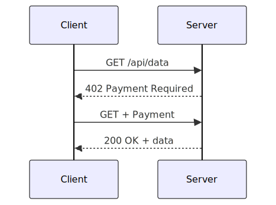
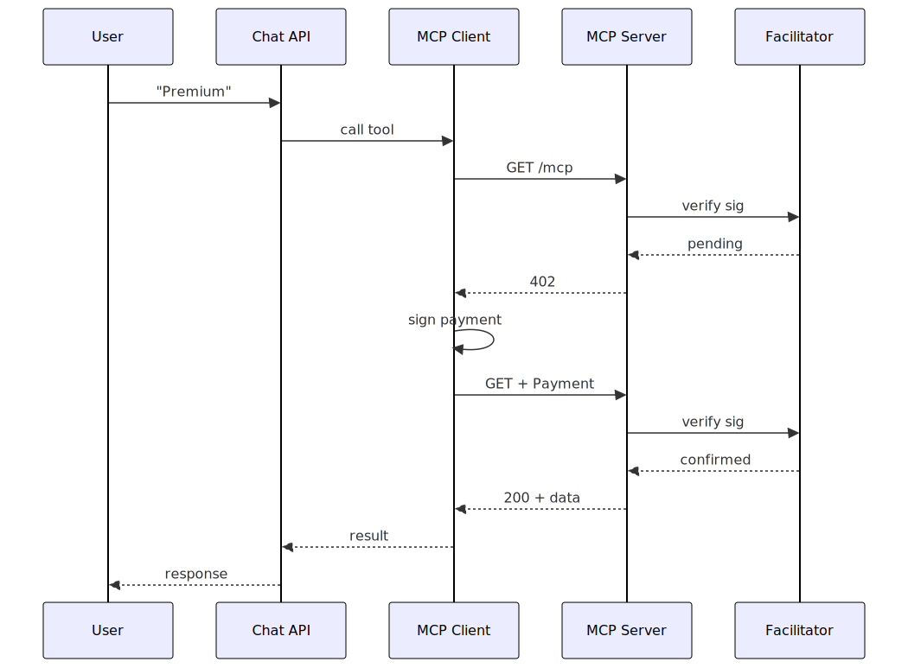

<!-- _class: lead -->
<!-- _paginate: false -->

# Building AI Agents with x402 Crypto Payments

## A Workshop on Monetizing AI with HTTP-Native Payments

---

# Agenda

1. **The Problem**: Why AI agents need payments
2. **x402 Protocol**: HTTP-native crypto payments
3. **Architecture**: How it all fits together
4. **Hands-on Implementation**: Step-by-step code walkthrough
5. **Multi-Chain Support**: EVM + Solana
6. **Best Practices**: Security, UX, and reliability
7. **Live Demo**: See it in action

---

<!-- _class: lead -->

# Part 1: The Problem

## Why AI Agents Need Native Payment Capabilities

---

# The Rise of AI Agents

AI agents are becoming autonomous actors in the digital world:

- **Tool-calling agents** that execute actions on behalf of users
- **Autonomous workflows** that make decisions and take actions
- **MCP (Model Context Protocol)** enabling standardized tool access

**But there's a gap...**

---

# The Payment Gap


**Current solutions require:**
- Pre-paid subscriptions
- Credit cards on file
- Manual intervention

**Breaking the autonomous flow**

---

# What We Need

An AI agent should be able to:

1. **Discover** the price of a service
2. **Decide** if it's worth paying
3. **Pay** autonomously without human intervention
4. **Receive** the service

All in a single HTTP transaction.

---

<!-- _class: lead -->

# Part 2: x402 Protocol

## HTTP-Native Crypto Payments

---

# What is x402?

x402 is a protocol that enables **payments over HTTP**:

<div style="text-align: center;">
  
</div>

---

# The 402 Status Code

HTTP defined `402 Payment Required` in 1992 — x402 brings it to life!

```json
// HTTP/1.1 402 Payment Required
{
  "accepts": [{
    "scheme": "exact",
    "network": "eip155:84532",
    "maxAmountRequired": "10000",
    "resource": "/api/premium",
    "description": "Premium API access"
  }]
}
```

---

# Payment Authorization (EIP-3009)

For EVM chains, x402 uses **EIP-3009** - transfer with authorization:

```typescript
{
  // Authorize USDC transfer without gas
  signature: "0x...",
  from: purchaserWallet,
  to: sellerWallet,
  value: 10000,  // $0.01 USDC (6 decimals)
  validAfter: timestamp,
  validBefore: timestamp + 1hour,
  nonce: randomBytes32
}
```

**No gas fees for the payer!**

---

# Why x402 for AI Agents?

| Feature | Benefit for AI Agents |
|---------|----------------------|
| HTTP-native | Works with any HTTP client |
| Stateless | No session management needed |
| Instant settlement | Real-time payment verification |
| Micropayments | Pay $0.01 or less efficiently |
| Multi-chain | USDC on Base, Solana, etc. |

---

<!-- _class: lead -->

# Part 3: Architecture

## How x402 + AI Agents Work Together

---

# High-Level Architecture


---

# Key Components

### 1. Purchaser Wallet
- Pays for tool calls on behalf of the user
- Signs EIP-3009 authorizations
- Holds USDC for payments

### 2. Seller Wallet
- Receives payments for premium tools
- Configured on MCP server

### 3. Facilitator
- Validates payment signatures
- Settles USDC transfers on-chain
- Prevents replay attacks

---

# Payment Flow Sequence



---

<!-- _class: lead -->

# Part 4: Implementation

## Building an x402-Powered AI Agent

---

# Project Setup

```bash
# Clone the starter template
git clone https://github.com/vercel-labs/x402-ai-starter
cd x402-ai-starter
pnpm install

# Install dependencies
pnpm add x402-mcp @coinbase/cdp-sdk \
  @ai-sdk/mcp @modelcontextprotocol/sdk \
  ai @ai-sdk/deepseek
```

---

# Environment Configuration

```bash
# .env.local

# Wallet Configuration (CDP-managed)
CDP_API_KEY_ID=your_key_id
CDP_API_KEY_SECRET=your_secret
CDP_WALLET_SECRET=your_wallet_secret

# Or Self-managed keys
EVM_PRIVATE_KEY=0x...
EVM_NETWORK=base-sepolia

# AI Provider
DEEPSEEK_API_KEY=your_key

# App Config
NETWORK=base-sepolia
URL=http://localhost:3000
```

---

# Wallet Management

```typescript
// src/lib/accounts.ts
import { CdpClient } from "@coinbase/cdp-sdk";

let cdp: CdpClient | null = null;

export async function getOrCreatePurchaserAccount() {
  if (!cdp) cdp = new CdpClient();

  // Get or create wallet with auto-faucet on testnet
  const account = await cdp.evm.getOrCreateAccount({ name: "Purchaser" });

  return account; // Has signTypedData for EIP-3009
}
```

---

# MCP Server with Paid Tools

```typescript
// src/app/mcp/route.ts
import { createPaidMcpHandler } from "x402-mcp/server";

const handler = createPaidMcpHandler((server) => {
  // Free tool
  server.tool("add", "Add two numbers", { a: z.number(), b: z.number() },
    async ({ a, b }) => ({ content: [{ type: "text", text: String(a + b) }] }));

  // Paid tool - $0.01 USDC
  server.paidTool("premium_random",
    { price: 0.01, description: "Premium random" },
    { min: z.number(), max: z.number() },
    async ({ min, max }) => {
      const num = Math.floor(Math.random() * (max - min + 1)) + min;
      return { content: [{ type: "text", text: String(num) }] };
    });
}, { serverInfo: { name: "x402-mcp", version: "1.0.0" } },
   { recipient: sellerAddress, network: "base-sepolia" });
```

---

# Chat API with Payment Support

```typescript
// src/app/api/chat/route.ts
import { withPayment } from "x402-mcp/client";
import { createMCPClient } from "@ai-sdk/mcp";

export const POST = async (request: Request) => {
  const purchaserAccount = await getOrCreatePurchaserAccount();

  // Create MCP client
  const baseMcpClient = await createMCPClient({
    transport: new StreamableHTTPClientTransport(
      new URL("/mcp", env.URL)
    ),
  });

  // Wrap with payment capabilities
  const mcpClient = await withPayment(baseMcpClient, {
    account: purchaserAccount,
    network: env.NETWORK,
    maxPaymentValue: 0.1 * 10 ** 6, // Max $0.10 per call
  });

  const tools = await mcpClient.tools();
  // ... use tools with streamText
};
```

---

# The withPayment() Magic

```typescript
async function withPayment(client, options) {
  const originalCall = client.callTool.bind(client);

  client.callTool = async (name, args) => {
    let response = await originalCall(name, args);

    if (response.status === 402) {  // Intercept 402 Payment Required
      const payment = await parsePaymentRequirements(response);
      const signature = await options.account.signTypedData({
        domain: payment.domain, types: payment.types, message: payment.message
      });
      response = await originalCall(name, args, { headers: { "X-Payment": signature } });
    }
    return response;
  };
  return client;
}
```

---

# Running the Application

```bash
# Start development server
pnpm dev

# Open browser
open http://localhost:3000
```

**Test prompts:**
- "What is 5 + 3?" (free tool)
- "Get a random number between 1 and 10" (free tool)
- "Get a premium random number between 1 and 100" (paid $0.01)
- "Check my USDC balance" (view wallet)

---

<!-- _class: lead -->

# Part 5: Multi-Chain Support

## Extending to Solana and Beyond

---

# Why Multi-Chain?

| Chain | Benefits | Use Case |
|-------|----------|----------|
| **Base** | Low fees, EVM-compatible | Mainnet payments |
| **Base Sepolia** | Testnet, faucet available | Development |
| **Solana** | Ultra-fast, low fees | High-frequency micropayments |
| **Ethereum** | Largest ecosystem | Premium services |

**Different chains for different use cases**

---

# Multi-Chain Wallet Setup

```typescript
import { privateKeyToAccount } from "viem/accounts";
import { createKeyPairSignerFromBytes } from "@solana/kit";

// EVM wallet (Base, Ethereum)
export async function getEvmWallet() {
  const account = privateKeyToAccount(env.EVM_PRIVATE_KEY);
  return { signer: toClientEvmSigner(account), network: env.EVM_NETWORK };
}

// Solana wallet
export async function getSolanaWallet() {
  const keypair = await createKeyPairSignerFromBytes(base58.decode(env.SVM_PRIVATE_KEY));
  return { signer: toClientSvmSigner(keypair), network: env.SOLANA_NETWORK };
}
```

---

# Unified Payment Client

```typescript
// src/lib/payment-client.ts
import { x402Client } from "@x402/core/client";
import { ExactEvmClient } from "@x402/evm";
import { ExactSvmClient } from "@x402/svm";

export async function createMultiChainPaymentClient() {
  const { signer: evmSigner } = await getEvmWallet();
  const { signer: svmSigner } = await getSolanaWallet();

  return new x402Client()
    // Register EVM chains (Base, Ethereum)
    .register("eip155:*", new ExactEvmClient(evmSigner))
    // Register Solana
    .register("solana:*", new ExactSvmClient(svmSigner));
}
```

---

# Multi-Chain Tool Configuration

```typescript
// Accept payments on multiple chains
server.paidTool("cross_chain_analysis",
  {
    price: 0.05,
    accepts: [
      { scheme: "exact", network: "eip155:84532", payTo: evmAddress },
      { scheme: "exact", network: "solana:EtWTRAB...", payTo: solAddress },
    ],
  },
  { ticker: z.string() },
  async (args) => {
    // Tool implementation
  }
);
```

---

<!-- _class: lead -->

# Part 6: Best Practices

## Security, UX, and Reliability

---

# Security Checklist

- [ ] **Never hardcode private keys** - Use environment variables
- [ ] **Validate all inputs** - Zod schemas for API endpoints
- [ ] **Set max payment limits** - Prevent runaway costs
- [ ] **Use testnet first** - Verify flow before mainnet
- [ ] **Monitor wallet balances** - Alert on low funds
- [ ] **Log all transactions** - Audit trail for accounting

---

# Input Validation

```typescript
// Always validate at API boundaries with Zod
const ChatRequestSchema = z.object({
  messages: z.array(z.object({
    role: z.enum(["user", "assistant", "system"]),
    content: z.string().optional(),
  })),
  model: z.enum(["deepseek-chat", "deepseek-reasoner"]).default("deepseek-chat"),
});

const validated = ChatRequestSchema.safeParse(body);
if (!validated.success) {
  return new Response(JSON.stringify({ error: "Invalid request" }), { status: 400 });
}
```

---

# User Experience Tips

1. **Clear pricing** - Show cost before payment
2. **Transaction links** - Provide block explorer links
3. **Error handling** - Graceful failures with retry options
4. **Loading states** - Show progress during payment
5. **Balance display** - Let users check their balance

```typescript
// Show payment result with transaction link
<Link href={`https://sepolia.basescan.org/tx/${txHash}`}>
  View transaction →
</Link>
```

---

# Error Handling

```typescript
try {
  const result = await mcpClient.callTool("premium_random", args);
  return result;
} catch (error) {
  if (error.code === "INSUFFICIENT_BALANCE") {
    return "Your wallet needs more USDC. Top up at faucet.circle.com";
  }
  if (error.code === "PAYMENT_FAILED") {
    return "Payment failed. Please try again.";
  }
  console.error("Unexpected error:", error);
  return "An error occurred. Our team has been notified.";
}
```

---

# Monitoring & Observability

```typescript
// Log all payments for auditing
const paymentLog = {
  timestamp: new Date().toISOString(),
  tool: toolName, amount: paymentAmount, user: userId,
  transaction: txHash, network: networkId,
};
await db.paymentLogs.create(paymentLog);

// Alert on low balance
if (balance < 1000000) await sendAlert(`Wallet balance low: $${balance / 1e6}`);
```

---

<!-- _class: lead -->

# Part 7: Live Demo

## See It In Action

---

# Demo Flow

1. **Open** http://localhost:3000
2. **Check balance** - "What is my USDC balance?"
3. **Use free tool** - "Add 5 and 3"
4. **Use paid tool** - "Get a premium random number"
5. **Verify payment** - Check balance decreased
6. **View transaction** - Click the Basescan link

---

# Expected Results

| Step | Action | Result |
|------|--------|--------|
| 1 | Check balance | $0.96 USDC |
| 2 | Call free tool | "8" - no payment |
| 3 | Call paid tool | Random number + $0.01 payment |
| 4 | Check balance | $0.95 USDC |
| 5 | View transaction | `0xa604da...` on Base Sepolia |

---

# Transaction Verification

```text
Transaction: 0xa604da96842260e50cdb7f1909b34fdbd15e7ef7e98a4e1145b836911e9fe5ae

Network: Base Sepolia
From: 0xd407e409E34E0b9afb99EcCeb609bDbcD5e7f1bf (Purchaser)
To: [Seller Address]
Value: 0.01 USDC

Status: Success ✓
```

---

<!-- _class: lead -->

# Part 8: Future Directions

## What's Next for x402 + AI

---

# Coming Soon

- **Agentic Commerce** - Agents buying/selling autonomously
- **Cross-agent payments** - Agents paying other agents
- **Subscription tools** - Recurring payments for premium access
- **Dynamic pricing** - Demand-based tool pricing
- **Privacy payments** - Anonymous micropayments

---

# Getting Started Resources

- **x402 Protocol**: https://github.com/coinbase/x402
- **Starter Kit**: https://github.com/vercel-labs/x402-ai-starter
- **MCP Specification**: https://modelcontextprotocol.io
- **Base Sepolia Faucet**: https://faucet.circle.com
- **DeepSeek API**: https://platform.deepseek.com

---

<!-- _class: lead -->

# Thank You!

## Questions?

**GitHub**: github.com/aijayz/crypto-pay-agent
**x402**: x402.org
**Base**: base.org

---

# Appendix: Network Configuration

| Network | Chain ID | Faucet |
|---------|----------|--------|
| Base Sepolia | 84532 | faucet.circle.com |
| Base Mainnet | 8453 | Buy USDC on exchange |
| Solana Devnet | EtWTRAB... | `solana airdrop 2` |
| Ethereum | 1 | Buy USDC on exchange |

---

# Appendix: Environment Variables

```bash
# CDP-Managed Wallets              # Self-Managed Wallets
CDP_API_KEY_ID=                    EVM_PRIVATE_KEY=0x...
CDP_API_KEY_SECRET=                SVM_PRIVATE_KEY=base58...
CDP_WALLET_SECRET=

# AI Provider                      # App Config
DEEPSEEK_API_KEY=                  NETWORK=base-sepolia
                                   URL=http://localhost:3000
```